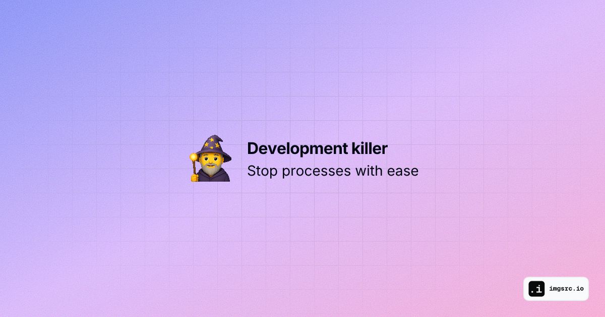

# kill-dev

Are you also to dumb to remember simple kill ports command? I've got your back. A powerful CLI tool to find and kill development server processes on specified or common dev ports. 



## Features

- 🔍 Automatically scans common development ports (Next.js, React, Vite)
- 🎯 Supports specific port numbers or port ranges
- 📋 Interactive process selection
- 💪 Works on Windows, macOS, and Linux

## Installation

1. Install the package:
This method is currently not available, you'll have to install it from the source code.
```bash
npm install -g @remcostoeten/kill-development-ports
```

1. Install from source

Clone the repository:
```bash
git clone https://github.com/remcostoeten/kill-development-ports.git
cd kill-development-ports
rm -rf assets README.md LICENSE
npm i -g 
echo 'reload terminal and you should be able to use the command'
```
If npm fails try `--force` or use `pnpm`.

For other shortcuts add in your `.zshrc` or `.bashrc`
`alias x='kill-dev'`

## Usage

```bash
# Scan default ports (3000-3010, 5173-5183)
kill-dev

# Scan specific port
kill-dev 3000

# Scan multiple ports
kill-dev 3000 8080

# Scan port range
kill-dev 3000-3005

# Mix ports and ranges
kill-dev 3000 8000-8010
```

### Alternative Command

You can also use the `kill-port` command which works exactly the same:

```bash
kill-port 3000
```

### Interactive Selection

1. The tool will scan for processes on the specified ports
2. Select processes using:
   - `Space` to select/deselect individual processes
   - `a` to toggle all processes
   - `i` to invert selection
   - `Enter` to confirm and proceed

## Default Ports

- Next.js/React: 3000-3010
- Vite: 5173-5183

## Requirements

- Node.js >= 14.0.0

## License

MIT © [Remco Stoeten](https://github.com/remcostoeten)
